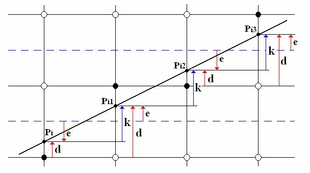

## Bresenham算法

考虑斜率 $k<1$




每一步 $d=d+k$, 
if $d\ge 0.5$ then $d=d-1$, $y = y+1$

```c
function line(x0, y0, x1, y1)
    real deltax := x1 - x0
    real deltay := y1 - y0
    real deltaerr := abs(deltay / deltax)     
    real error := 0.0                  // No error at start
    int y := y0
    for x from x0 to x1 
        plot(x, y)		  // plot start
        error := error + deltaerr  // next error
        if error ≥ 0.5 then
            y := y + sign(deltay)  // next y
            error := error - 1.0
```


#### 改进1

设 $$e=2d-1$$

$$e = e + 2k$$

if $e \ge 0$ then $e = e - 2, y = y+1$

```py
x,y = x1,y1
dx,dy=(x2-x1),(y2-y1)
k = dy/dx
e = -1          # 2d-1 and d = 0 at start 
for i in range(dx):
	setpixel(x,y)
	e += 2*k   # next error
	if e >=0:
		y += 1
		e = e-2 
	x += 1
```

#### 改进2

$e \to e\times \Delta x$ 其中 $\Delta x$ 是起点和终点水平距离 那么 $e$ 变成了整数

```c
void line(int x0, int y0, int x1, int y1, TGAImage &image, TGAColor color) {
    int dx = x1 - x0;
    int dy = y1 - y0;
    int D = - dx;
    int y = y0;

    for(int x = x0; x < x1; x++){
        image.set(x,y,color);// current pixel
        D = D + 2*dy;        // next error
        if(D>0){
            y++;             // next y
            D = D - 2*dx;
        }
    }
}
```