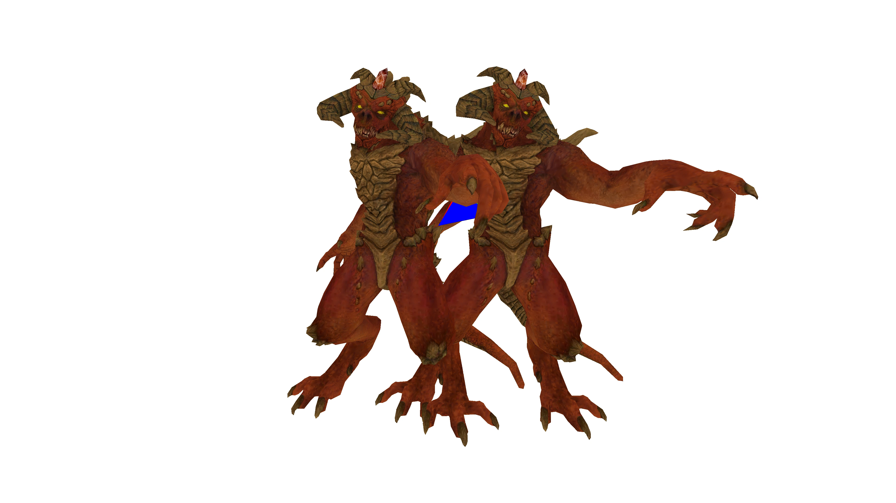
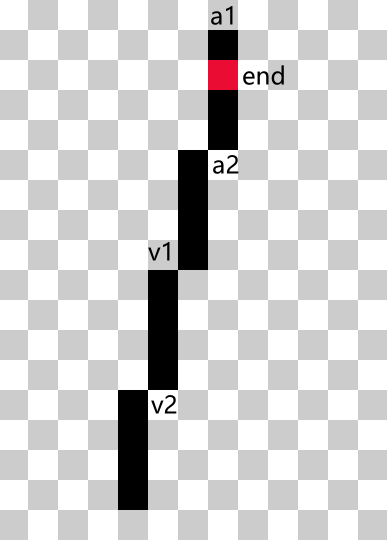
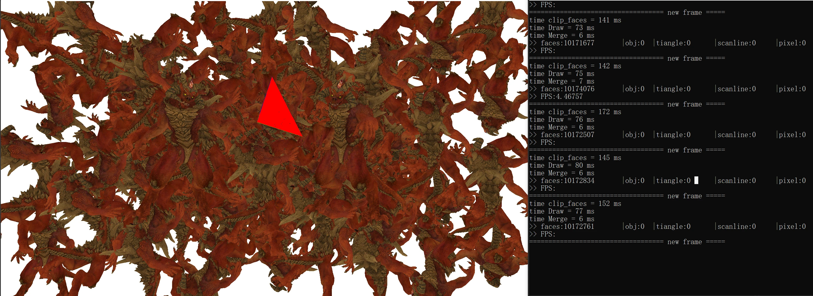

 


## 一、概述

该渲染器完全从头实现，仅依赖C++标准库，和用于帧输出的OpenGL库，实现了1080P分辨率下千万级面片的实时渲染和贴图（4.4 FPS，无光照）。并且我对实现过程中遇到的一些性能瓶颈进行了测试和优化，发现内存延迟是提高该渲染器性能的最大限制。本渲染器实现了要求的 层次 z-buffer 和场景八叉树算法。本渲染器测试场景使用一个 5000 片元的模型动态排列得到。

## 二、简单 z-buffer 算法的渲染流程

本渲染器仅实现了三角片元的3D渲染和纹理贴图，不支持光照，输出分辨率可调，但必须宽度大于高度。主要用到的算法是 Bresenham 光栅化算法和

### 1. 模型文件加载和物体生成

- 本渲染器仅支持简单 obj 模型的加载和单张 bmp 贴图。模型加载相关代码来自 https://github.com/skywind3000/RenderHelp。 模型加载生成顶点数组、法向量数组、纹理坐标数组、三角形片元数组和纹理。三角形片元每个顶点格式为：顶点索引/纹理坐标索引/顶点法向量索引。
- 物体从模型文件生成，包含额外的位置齐次坐标和缩放系数。
- 相机由位置齐次坐标和屏幕缩放系数组成。

### 2. 顶点坐标转换和投影

相对于世界参考系，设物体位置坐标 $T_o$, 物体缩放 $\alpha$, 相机位置坐标 $T_c$, 屏幕缩放 $\beta$, 则顶点 $v$ 在相机参考系中坐标为 $$\beta \times T_c^{-1}\times T_o \times \alpha \times v$$

设顶点 $v$ 在相机坐标系中的坐标为 $(x, y, z)$, 屏幕宽高为 $w, h$, 则透视投影后顶点在屏幕上的坐标为 $$(\frac{x}{z}+0.5w, \frac{y}{z}+0.5h)$$

这里假设用户使用的是直面屏，直接除以深度 $z$。如果是曲面屏，可能要除以顶点到相机的距离。

### 3. 视锥剔除和背面剔除

得到三角形各个顶点在屏幕上坐标和深度后，剔除全部在屏幕范围外的三角形和深度小于一定值的三角形。如果物体是封闭的，还可以剔除投影后顶点为顺/逆时针的面片（取决于原始文件生成时的定义）。

### 4. 三角形的光栅化

本渲染器使用了 Bresenham 算法从左到右进行三角形的光栅化。定义坐标格点在像素中心，绘制起始点和结束点，例如 $(0,0), (2,0)$定义的线段将绘制第一行前三个点。具体流程为：

1. 对三角形顶点进行从左到右排序得到 $(x_1, x_2, x_3)$ 三个顶点。
2. 判断中间顶点在对边上方还是下方，分别使用不同的直线光栅器配置，得到扫描线的上下两个端点。如下图所示，当边线斜率绝对值大于1时，会有多个点。若是上方则返回 $v_1$, 若在下方则返回 $v_2$，确保将边线也进行绘制。
3. 绘制区间 $[v_1, v_2)$ 和 $[v_2, v_3)$ 的竖直扫描线。
4. 对于最后一条扫描线，上述方法不能准确判断端点，特别是当 $x_2, x_3$ 竖直时。会出现最后一条扫描线多绘制的情况。这时根据准确的 $y$ 值判断应该绘制的区间。具体算法见代码。




Bresenham 算法光栅化三角形的优点：
- 不会绘制多余的点，也不会少绘制点；
- 每个三角形完全精确绘制，边线像素完全确定；
- 仅使用整数加减法和位运算，对于斜率小于1的直线，使用位运算优化后不需要分支，速度极快。


### 5. 插值与像素着色

**平面三角形的插值**

对于平面三角形，使用重心坐标系系数对顶点的纹理坐标进行插值。设三角形三个顶点为 $(x_1, y_1), (x_2, y_2), (x_3, y_3)$，插值系数为 

$$
\begin{aligned}
 \lambda_1&= \frac{(y_2-y_3)(x-x_3)+(x_3-x_2)(y-y_3)}{(y_2-y_3)(x_1-x_3)+(x_3-x_2)(y_1-y_3)}\, \\
\lambda_2 &=\frac{(y_3-y_1)(x-x_3)+(x_1-x_3)(y-y_3)}{(y_2-y_3)(x_1-x_3)+(x_3-x_2)(y_1-y_3)}\, \\
\lambda_3=1-\lambda_1-\lambda_2&=\frac{(y_1-y_2)(x-x_1) + (x_2-x_1)(y-y_1)}{(y_2-y_3)(x_1-x_3)+(x_3-x_2)(y_1-y_3)} 
\end{aligned}
$$

**透视投影后的插值**

因为透视投影只是除以 $z$， 只要将带插值的参数除以所在顶点的 $z$，再按上述系数线性插值，再乘上当前顶点的深度 $z'$ 即可。

**深度的插值**

投影后深度相对于屏幕坐标仍然是线性的，
$$
dx  = \frac{(y_2-y_1)(z_2-z_3)+(y_2-y_3)(z_1-z_2)}{(y_2-y_3)(x_1-x_3)+(x_3-x_2)(y_1-y_3)} \\
dy  = \frac{(x_1-x_2)(z_2-z_3) + (x_3-x_2)(z_1-z_2)}{(y_2-y_3)(x_1-x_3)+(x_3-x_2)(y_1-y_3)}\\
z' = z_0 + (x'-x_0)dx + (y'-y_0)dy
$$

可以事先计算系数，然后快速得到 $z$ 值。

### 6. z-buffer 消隐

如果要更新的像素 $z$ 值小于已有的 $z$ 值， 说明要更新的像素离屏幕更近，则纹理插值并更新像素，否则不更新。

注：简单 z-buffer 的扫描线光栅化算法与课件中提到的原始扫描线 z-buffer 算法性能一致，可以作为 baseline。

## 三、简单 z-buffer 渲染器的优化

### 简单场景

25000 片元， 1080P，单线程。当片元比较少时，纹理采样占用大部分时间，应该是 cache miss 造成。

1. bitmap 采样使用双线性插值，直接用不插值的采样，每帧渲染时间直接减少一倍：$60ms \to 27ms$
2. 提前判断是否绘制，再进行插值：$27ms \to 23ms$
3. 使用纯色绘制所有点：$23ms \to 17ms$
4. 背面剔除：$23ms \to 13ms$

### 复杂场景

100万 片元，1080P。

1. 将每个模型的片元按深度从近到远排序，然后将每个模型按深度从近到远排序，从而减少无效的像素着色。
   优化后性能：片元组装 $93ms$, 光栅化 $170ms$。
2. 片元组装阶段及之前，模型间没有依赖，可以直接用 openmp 进行多线程加速。如果直接用多线程更新 z-buffer，会造成数据冲突，而加锁方法本质上还是单线程，只能加速 z-buffer 之前的阶段，并且引入的开销太大。测试发现 1000万 片元的光栅化单线程只需 $70ms$， 大部分耗时还是在 z-buffer 的更新上。因此给每个线程分配一个 z-buffer, 最后使用单线程合并，达到 z-buffer 的并行化。
   优化后性能（6核10线程）：片元组装 $13ms$, 光栅化 $43ms$，合并z-buffer：$5ms$
   （注：多线程下不能使用公共变量统计绘制的三角形总数，否则会导致缓存一致性问题，严重降低性能）
3. 背面剔除：片元组装 $8ms$, 光栅化 $29ms$，合并z-buffer：$5ms$

最终达到 21 FPS。在1000万片元下完全并行的简单 z-buffer 渲染器也能达到 3 FPS。

## 四、层次 z-buffer


层次z_buffer允许提前判断 物体/片元/扫描线等 是否可见，降低计算量。在本测试场景中，提前判断物体作用不大，物体基本都可见。扫描线消隐没有作用，因为片元消隐已经足够，而且扫描线消隐会有新的开销。

层次 z-buffer 从底向上使用 $1\times1,2\times2,4\times 4, 8\times8 \cdots$ 的 tile，直到覆盖整个屏幕。但是层次 z-buffer 的访问和更新会带来额外的开销。因此我通过测试使用了一些优化方法。

### 1. 位运算代替分支

着色时需要更新 z-buffer，而每层 z-buffer 是否更新具有随机性，cpu的分支预测器难以命中，造成比较严重的惩罚。使用位运算优化后提速明显。
Bresenham 算法中更新误差需要分支。当三角形边线斜率绝对值小于1时，可以使用位运算代替分支。不过这一分支具有一定的规律性，优化后提升不明显。

下表是通过控制片元绘制数量得到的优化前 **光栅化+着色** 性能数据。

| 耗时  | 片元  | 像素  |
| ----- | ----- | ----- |
| 190ms | 23万  | 300万 |
| 270ms | 48万  | 310万 |
| 350ms | 73万  | 310万 |
| 430ms | 97万  | 300万 |
| 500ms | 123万 | 310万 |

绘制 300 万像素：$110ms$
光栅化 23 万片元：$80ms$

层次 z-buffer 优化后

| 耗时  | 片元  | 像素  |
| ----- | ----- | ----- |
| 140ms | 23万  | 300万 |
| 220ms | 48万  | 310万 |
| 300ms | 73万  | 310万 |
| 380ms | 97万  | 300万 |
| 460ms | 123万 | 310万 |

绘制 300 万像素：$60ms$
光栅化 23 万片元：$80ms$

Bresenham 优化后

| 耗时  | 片元  | 像素  |
| ----- | ----- | ----- |
| 410ms | 123万 | 310万 |

绘制 300 万像素：$60ms$
光栅化 23 万片元：$70ms$


### 2. 提前计算片元消隐时需要访问的指针

一般的层次 z-buffer 算法从上往下判断片元是否可见，需要多层访问。实际上可以直接算出最后需要访问的那一层坐标。流程如下：

1. 从低向上寻找能覆盖查询片元的最小相邻4个tile，这样即使片元位于 $2^n$ 分割线两侧，也能够很好地被细分。也可以寻找 $4\times4=16$ 个 tile，进行更精确的消隐，但这样又会增加内存访问。
2. 在片元组装阶段保存这 4 个 tile 的指针。将片元组装并行化。
3. 在片元光栅化的初始阶段直接访问4个指针指向的深度信息，进行消隐。

相关代码：

```c
  int level = 0;
  while (x2 - x1 > 1 || y2 - y1 > 1)
  {
      x1 >>= 1;
      x2 >>= 1;
      y1 >>= 1;
      y2 >>= 1;
      level++;
  }
  int s = z_buffer_w[level];
  float *pz = z_buffers[level];
  float *pz1 = pz + s * y1 + x1;
  float *pz2 = pz + s * y1 + x2;
  float *pz3 = pz + s * y2 + x1;
  float *pz4 = pz + s * y2 + x2;
```
**光栅化+着色** 性能：

优化前
| 耗时  | 面片 | 像素  | 消隐面片 |
| ----- | ---- | ----- | -------- |
| 180ms | 13万 | 300万 | 1000万   |

优化后
| 耗时  | 面片 | 像素  | 消隐面片 |
| ----- | ---- | ----- | -------- |
| 130ms | 13万 | 300万 | 1000万   |

### 3. 并行的片元组装+片元深度排序

层次 z_buffer 只有在绘制顺序从近到远且遮挡多时效果好，如果是从远到近绘制则完全无用。因此在每个物体片元组装完成后使用 C++ 标准库的 `sort()` 函数对片元进行排序，这一步可以使用多线程并行。然后再在物体层面排序，最后由近及远绘制。
优化后 1000万 片元只有数十万需要光栅化。并行的片元组装在12线程下耗时 $140ms$。

**结果：**

1000万片元（不做背面剔除） 片元组装 $140ms$， 着色 $110ms$，平均 FPS 3.7。
100万片元（不做背面剔除）  片元组装 $18ms$， 着色 $110ms$，平均 FPS 7.2。

### 4. 并行化层次 z-buffer

**结果：**

1000万片元（不做背面剔除） 片元组装 $141ms$， 着色 $77ms$，平均 FPS 4.4。
100万片元（不做背面剔除）  片元组装 $16ms$， 着色 $42ms$，平均 FPS 14.5。


## 五、场景八叉树

场景八叉树可以在更粗的粒度上进行消隐，加速消隐和着色。但是八叉树的构建带来了额外的内存和计算开销。本渲染器是为每个物体创建一颗八叉树，对物体所包含的面片进行层次划分。在光栅化之前，对每层包围盒进行深度测试，如果最终叶子节点通过深度测试，则对其中的片元进行光栅化。并且总体上也是从近及远绘制的。本渲染器没有对所有片元统一构建八叉树，理由如下：

1. 游戏场景中一般是按物体绘制的
2. 所有片元统一构建八叉树的复杂度更高，且难以并行。设有 $m$ 个物体，每个物体 $n$ 个片元，则分别构建八叉树的复杂度是 $mn\log(n)$， 统一构建的复杂度 $mn\log(mn)=mn(\log m + \log n)$


**最终结果：**

1000万片元（不做背面剔除） 片元组装 $300ms$， 着色 $180ms$，平均 FPS 2。
100万片元（不做背面剔除）  片元组装 $33ms$， 着色 $180ms$，平均 FPS 4.5。

**分析：**

- 片元组装阶段只是将深度排序换成八叉树，但是变慢一倍左右，原因如下
  1. 八叉树使用链表进行快速排序，而基于c++标准库的深度排序虽然也是快速排序，却是直接排序，内存连续，不需要寻址。
  2. 直接排序复杂度 $O(N \log_2 N)$， 八叉树复杂度 $O(8N \log_8 N) = O(\frac{8}{3} N \log_2 N)$
  3. c++标准库的函数性能接近最优，而我实现的八叉树性能远非最优。
- 着色阶段虽然查询 z-buffer 次数变少，但是性能下降 60%，原因如下
  1. 从简单层次 z-buffer 的性能数据可以看出，消隐 1000 万片元和消隐 100 万片元的耗时一致，说明层次 z-buffer 的更新与着色才是瓶颈，八叉树无法优化这一部分。
  2. 需要访问八叉树的叶子节点才能得到需要光栅化的片元，而八叉树基于链表实现，内存不连续，这一过程带来了额外开销。
  3. 八叉树消隐在片元层面没有深度排序严格，实际上绘制的片元更多。


<div style = "page-break-after: always; "></div>

## 六、总结

在分辨率 1920*1080，测试场景下，不做背面剔除，三种实现的性能如下表：

<table>
    <tr>
        <th rowspan="2"> </th>
        <th colspan="2">简单 z-buffer 全并行</th>
        <th colspan="2">层次 z-buffer 片元组装并行 </th>
        <th colspan="2">层次 z-buffer + 八叉树 </th>
    </tr>
    <tr>
        <th>100万片元</th><th>1000万片元</th>
        <th>100万片元</th><th>1000万片元</th>
        <th>100万片元</th><th>1000万片元</th>
    </tr>
    <tr>
        <th >片元组装</th>
        <td> 14ms </td>
        <td> 114ms  </td>
        <td> 18ms </td>
        <td> 140ms  </td>
        <td> 33ms </td>
        <td> 330ms  </td>
    </tr>
    <tr>
        <th>光栅化片元数 </th>
        <td> 100万  </td>
        <td> 1000万  </td>
        <td> 18万 </td>
        <td> 19万  </td>
        <td> 28万 </td>
        <td> 28万  </td>
    </tr>
    <tr>
        <th>着色像素数 </th>
        <td> 190万  </td>
        <td> 200万  </td>
        <td> 220万 </td>
        <td> 220万  </td>
        <td> 510万 </td>
        <td> 510万  </td>
    </tr>
    <tr>
        <th>光栅化+着色 </th>
        <td> 46ms </td>
        <td> 200ms  </td>
        <td> 110ms </td>
        <td> 110ms  </td>
        <td> 180ms </td>
        <td> 180ms  </td>
    </tr>
    <tr>
        <th >平均 FPS</th>
        <td> 15 </td>
        <td> 3 </td>
        <td> 7.2 </td>
        <td> 3.7  </td>
        <td> 4.5 </td>
        <td> 2  </td>
    </tr>

</table>


对比几种算法，我们发现：
1. 简单 z-buffer 算法简单，开销小，适合重叠度低的场景；
2. 层次 z-buffer 能在片元 level 快速消隐，在重叠度很大的情况下使 光栅化+着色 耗时几乎不随片元数增加而增加。不过这一算法有些额外的开销，最好在多线程下使用，效果显著。
3. 八叉树虽然能在不同level消隐，但由于构建慢，精度低，实际上造成了反面效果，不适合全动态场景下使用。
4. 背面剔除能稳定提升 0.5 到 1 倍性能。

对于软渲染器的性能优化，我们发现：
1. 访存瓶颈远大于计算瓶颈，理论上深度排序将渲染器的时间复杂度从 $O(N)$ 提升到 $O(N \log N)$，但主要由于 z-buffer 更新减少，由近及远地绘制远快于不做深度排序随机绘制，后者每帧需要好几秒的时间来绘制。
2. 耗时：写入 z-buffer >> 光栅化像素点 > 读取 z-buffer，这是由 CPU 的缓存模型决定的。
3. 尽量操作连续数据和局部变量，即使计算量会有所增加。
4. 尽量减少非循环结构的分支，分支预测器无法预测没有规律的分支。
5. 利用多线程对不相关的操作进行并行从而加速每个流程，进一步消除计算瓶颈。计算密集的部分加速接近线性，IO 密集的部分加速不是线性的。
6. 流水线能大幅提升通量。使用合适的硬件同时处理流程的每一部分，并在计算密集的部分使用多线程，在 IO 密集的部分优化缓存架构，就能使帧率得到大幅提升。
7. 本次实验所用 CPU 为 Ryzen 3600 6C12T@4.35GHz.


## 七、附录

并行层次 z-buffer 算法  


